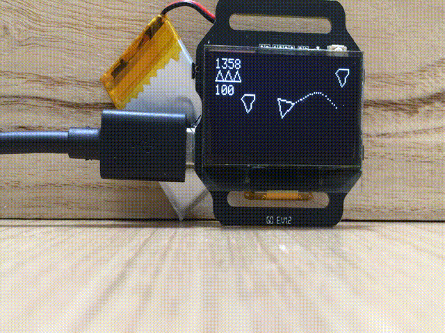
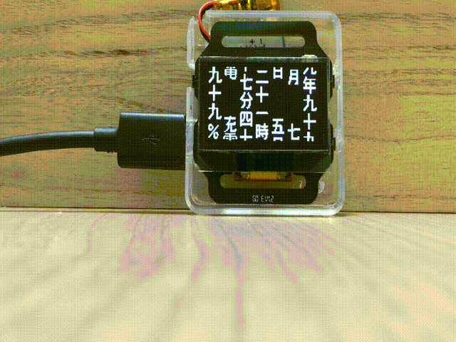

# Asteroids Watchface

An asteroids watchface for watchX.

Time is shown as the score (in the video, it is 13:58).  Battery life is shown as a percent.  When the watch is disconnected from USB, it will sleep after a few seconds and is woken with an interrupt.  In this mode, you should have a long battery life.  But in this mode, you cannot program the watch.  To program the watch, plug in the USB cord and press the button above the cord.  That will activating programming mode and you will see three ships on the top right (two ships for battery mode).  

If you press the same button again, it will switch to this [Matrix-like raining code](https://www.youtube.com/watch?v=SneR61OG4ZI&t=38s) page.  The code is actually Japanese for year, month, date, hour, min, and battery life (from right to left).

Pressing the button again and you will get a screen with date, time, battery charge (%), time since the usb was removed (minutes), change in battery level since usb was removed, and estimated battery life in minutes.

Pressing the button again returns you to asteroids.

To run, you will need to install the EnableInterrupt library https://github.com/GreyGnome/EnableInterrupt and the arduino-mpu6050 library.  Both are available in the Library Manager in Arduino IDE.

